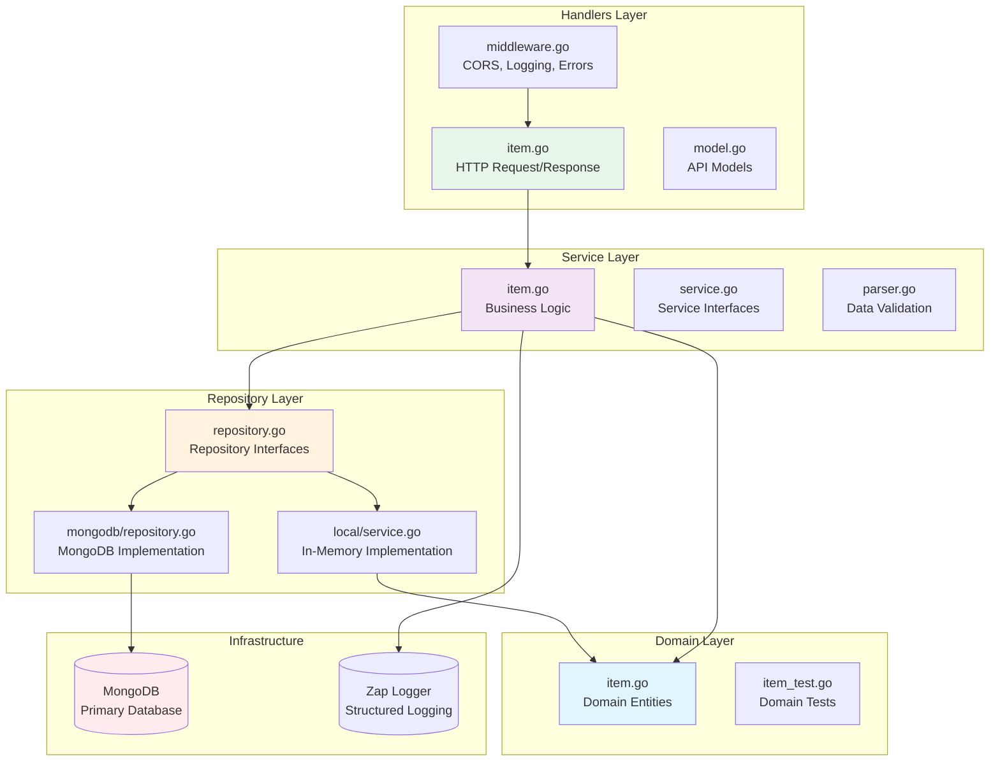
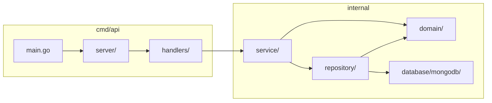
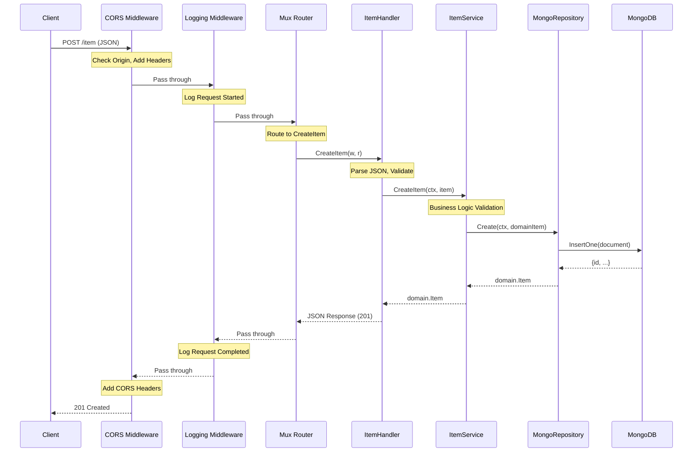
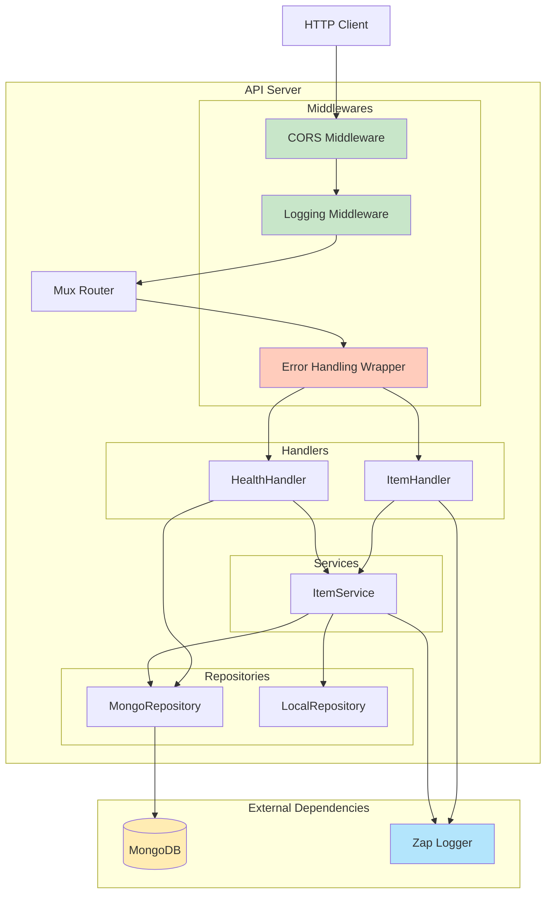

# Architecture Diagrams - List Manager API

## Clean Architecture Layer Diagram



## Package Dependency Graph



## Data Flow - Create Item Operation



## Component Interaction Diagram



## Request Lifecycle Overview

```mermaid
stateDiagram-v2
    [*] --> RequestReceived: HTTP Request
    RequestReceived --> CORSCheck: CORS Middleware
    CORSCheck --> LogRequest: Logging Middleware
    LogRequest --> Routing: Mux Router
    Routing --> ErrorHandling: Wrap Handler
    ErrorHandling --> HandlerExec: Execute Handler
    HandlerExec --> ServiceCall: Service Layer
    ServiceCall --> RepositoryCall: Repository Layer
    RepositoryCall --> DatabaseOp: MongoDB

    DatabaseOp --> ResponseBuild: Success
    RepositoryCall --> ErrorPropagate: Error
    ServiceCall --> ErrorPropagate: Error
    HandlerExec --> ErrorPropagate: Error

    ResponseBuild --> LogResponse: Logging Middleware
    LogResponse --> AddCORSHeaders: CORS Middleware
    AddCORSHeaders --> [*]: HTTP Response

    ErrorPropagate --> ErrorResponse: JSON Error Response
    ErrorResponse --> LogResponse
