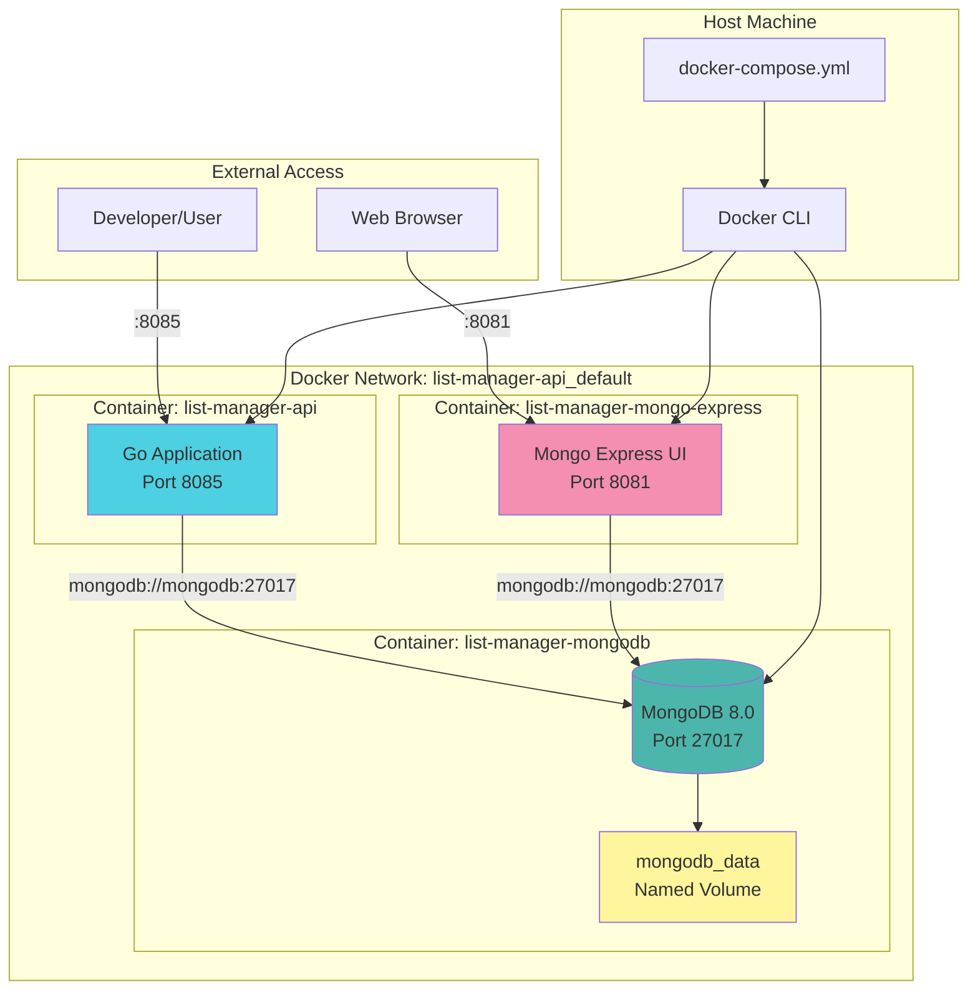
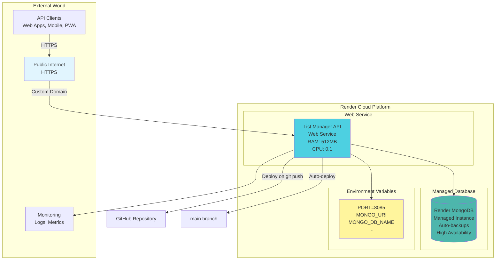
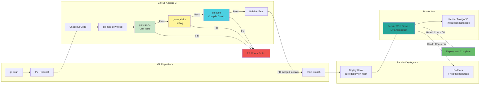
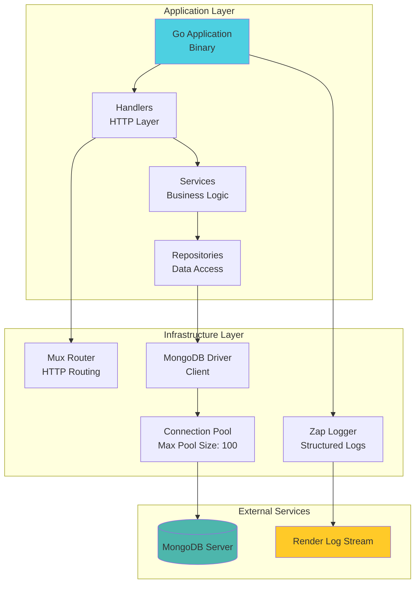
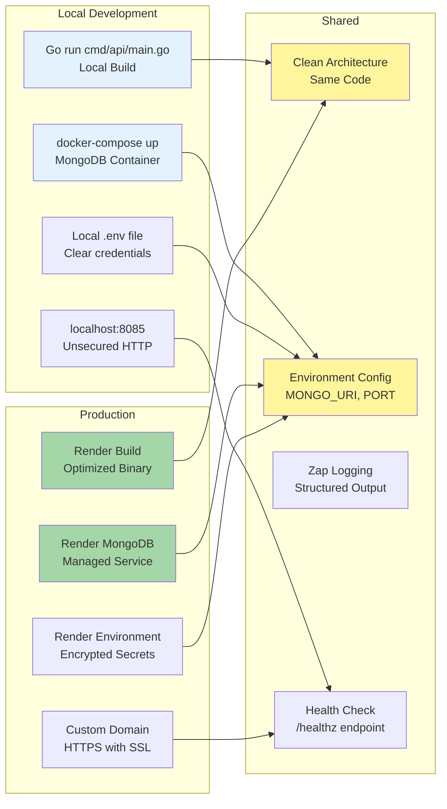

# Deployment Diagrams - List Manager API

## Docker Compose Architecture



## Local Development Environment

```mermaid
flowchart LR
    subgraph "Developer Machine"
        DEV[Developer]
        IDE[IDE/Editor<br/>VS Code, GoLand]
        TERM[Terminal]

        subgraph "Project Directory"
            SRC[/cmd/api<br/>/internal<br/>/docs]
            CFG[docker-compose.yml<br/>Makefile<br/>.env]
            GIT[.git/]
        end
    end

    subgraph "Docker Daemon"
        subgraph "Containers"
            C1[list-manager-api<br/>:8085]
            C2[mongodb<br/>:27017]
            C3[mongo-express<br/>:8081]
        end
        subgraph "Volumes"
            V1[mongodb_data]
        end
        subgraph "Networks"
            N1[list-manager-api_default]
        end
    end

    DEV --> IDE
    DEV --> TERM
    IDE --> SRC
    TERM --> SRC
    TERM -->|docker compose up| C1
    TERM -->|docker compose logs| C1
    TERM -->|docker compose down| C1

    C1 --> N1
    C2 --> N1
    C3 --> N1
    C2 --> V1

    SRC --> GIT

    style DEV fill:#e3f2fd
    style SRC fill:#e8f5e9
    style C1 fill:#4dd0e1
    style C2 fill:#4db6ac
    style C3 fill:#f48fb1
```

## Production Deployment (Render)



## CI/CD Pipeline



## Network Topology (Production)

```mermaid
flowchart TB
    subgraph "Internet"
        USER[End Users]
        CDN[CDN / Load Balancer<br/>Render Managed]
    end

    subgraph "Render Region: Oregon"
        subgraph "Private Network"
            API[list-manager-api<br/>Container 1]
            API2[list-manager-api<br/>Container 2<br/>(Auto-scale)]
            MONGO[(MongoDB<br/>Primary)]
        end
    end

    subgraph "Monitoring & Observability"
        LOGS[Render Logs<br/>Real-time streaming]
        METRICS[Metrics Dashboard<br/>CPU, Memory, Requests]
        ALERTS[Alerts<br/>Response time, Errors]
    end

    USER -->|HTTPS| CDN
    CDN -->|Round Robin| API
    CDN --> API2
    API --> MONGO
    API2 --> MONGO

    API --> LOGS
    API2 --> LOGS
    API --> METRICS
    API2 --> METRICS
    METRICS --> ALERTS

    style MONGO fill:#4db6ac
    style API fill:#4dd0e1
    style API2 fill:#26c6da
    style CDN fill:#fff59d
```

## Infrastructure Components



## Development vs Production Comparison


