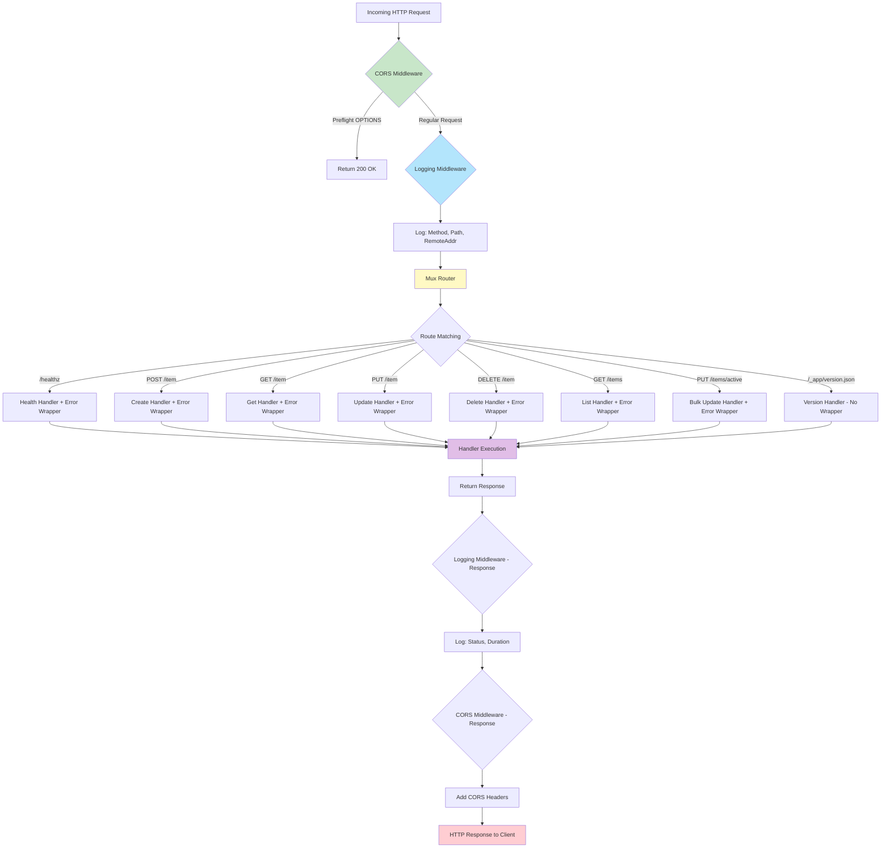
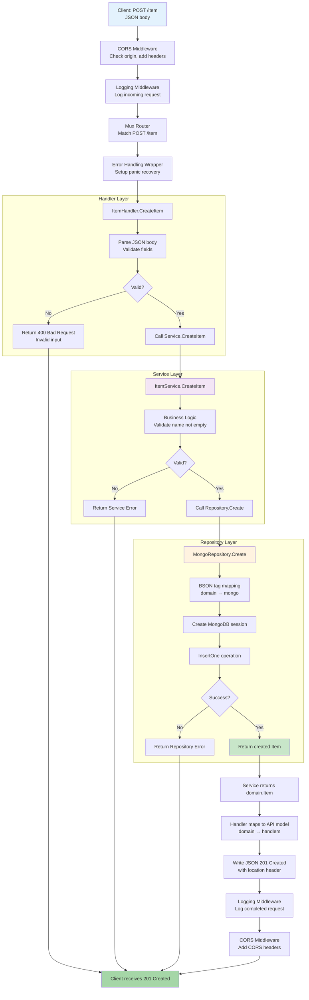
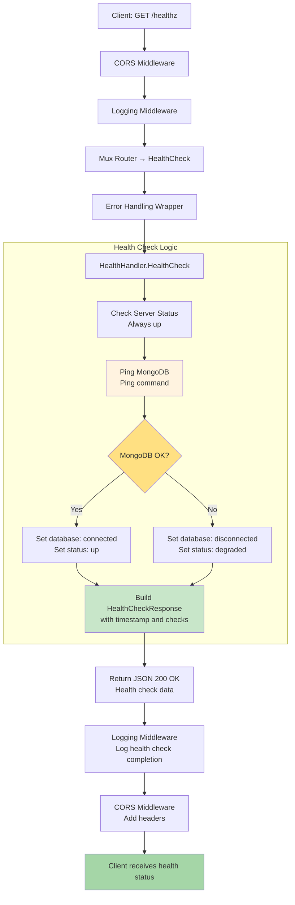

# Request Flow Diagrams - List Manager API

## Middleware Chain Flow



## Create Item Flow (Detailed)



## Error Flow Path

```mermaid
flowchart TD
    A[Handler Execution] --> B{Error Occurs?}
    B -->|No Error| C[Normal Response Path]
    B -->|Error Returned| D[Error Handling Wrapper]
    B -->|Panic| E[Recover Middleware]

    D --> F{Error Type?}
    F -->|Service Error| G[Map to HTTP Status<br/>400, 404, etc.]
    F -->|Repository Error| H[Map to HTTP Status<br/>500 or 404]
    F -->|Unknown Error| I[Return 500 Internal Error]

    E --> J[Log Stack Trace]
    J --> I

    G --> K[JSON Error Response<br/>{message: "..."}]
    H --> K
    I --> K

    K --> L[Logging Middleware<br/>Log error response]
    L --> M[CORS Middleware<br/>Add headers]
    M --> N[Client receives error response]

    C --> N

    style D fill:#ffccbc
    style E fill:#ef9a9a
    style I fill:#ef5350
    style K fill:#ffca28
```

## Health Check Flow



## Bulk Update Flow

```mermaid
flowchart TD
    A[Client: PUT /items/active<br/>{active: true}] --> B[CORS]
    B --> C[Logging]
    C --> D[Mux Router → BulkUpdateActive]
    D --> E[Error Wrapper]
    E --> F[Handler.BulkUpdateActive]

    F --> G[Parse JSON<br/>Extract active bool]
    G --> H{Valid?}
    H -->|No| I[Return 400]
    H -->|Yes| J[Service.BulkUpdateActive]

    J --> K[Repository.BulkUpdateActive<br/>with transaction]
    K --> L[Start MongoDB Session]
    L --> M[WithTransaction]
    M --> N[UpdateMany {active: <new_value>}]
    N --> O[Get MatchedCount & ModifiedCount]
    O --> P[Return counts to Service]

    P --> Q[Service returns counts]
    Q --> R[Handler maps to BulkActiveResponse]
    R --> S[Return JSON 200 OK<br/>{matchedCount, modifiedCount}]
    S --> T[Logging - Log completion]
    T --> U[CORS - Add headers]
    U --> V[Client receives 200 with counts]

    I --> V

    style K fill:#fff3e0
    style M fill:#ce93d8
    style S fill:#c8e6c9
```

## Complete Request/Response Lifecycle

```mermaid
sequenceDiagram
    participant C as Client
    participant CORS as CORS Middleware
    participant LOG as Logging Middleware
    participant R as Mux Router
    participant ERR as Error Wrapper
    participant H as Handler
    participant S as Service
    participant REPO as Repository
    participant DB as MongoDB

    Note over C,DB: Forward Path
    C->>CORS: POST /item
    CORS->>LOG: Request with headers
    LOG->>R: Request logged
    R->>ERR: Route matched
    ERR->>H: Wrapped handler call
    H->>S: Service call
    S->>REPO: Repository call
    REPO->>DB: Database operation
    DB-->>REPO: Result
    REPO-->>S: Domain entity
    S-->>H: Service result
    H-->>ERR: Response data

    Note over C,DB: Reverse Path
    ERR-->>LOG: Response to log
    LOG-->>CORS: Response with logs
    CORS-->>C: Final response

    Note over C,CORS: Headers added: Access-Control-Allow-Origin, etc.
    Note over LOG,LOG: Logged: method, path, status, duration
